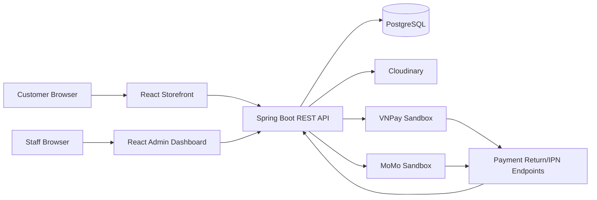

# SYSTEM_ARCHITECTURE

## Purpose

This document describes the high-level architecture of ElectronicsManagement.

The system has two browser surfaces and one backend API:

- Customer storefront.
- Admin/staff dashboard.
- Spring Boot REST API.

## System Diagram



## Runtime Parts

| Part | Location | Responsibility |
| --- | --- | --- |
| Storefront | `frontend/src/pages/client`, `frontend/src/components` | Customer browsing, cart, checkout, payment result, account, wishlist, notifications. |
| Admin dashboard | `frontend/src/pages/admin`, `frontend/src/admin` | CRUD and operational workflows for staff/admin users. |
| API | `backend/electronics/src/main/java/org/example/electronics` | Auth, business rules, persistence, payment, uploads, monitoring. |
| Database | PostgreSQL | Catalog, users, staff, roles, permissions, orders, payments, coupons, warehouse, media. |
| External services | Cloudinary, VNPay, MoMo | Media storage and sandbox payment handoff. |

## Frontend Responsibilities

- Render storefront and admin experiences.
- Own UI state, loading/error/empty states, and route guards.
- Keep API access centralized under `frontend/src/api`.
- Normalize API response wrappers in mapper/service modules.
- Persist cart/wishlist snapshots locally where backend public APIs are incomplete.
- Store auth through `frontend/src/auth/authStorage.js`.
- Preserve the existing homepage layout unless explicitly changed.

## Backend Responsibilities

- Authenticate admin/staff with JWT.
- Enforce admin role/permission checks.
- Validate request DTOs and lifecycle transitions.
- Persist domain state through JPA repositories.
- Process orders, coupons, warehouse operations, payment callbacks, and media uploads.
- Emit structured monitoring logs and request ids.
- Provide health/readiness probes for deployment.

## Data Ownership

| Domain | Source of truth |
| --- | --- |
| Catalog, variants, media | Backend API and PostgreSQL |
| Admin users/staff/roles/permissions | Backend API and PostgreSQL |
| Orders, payments, coupons, warehouse | Backend API and PostgreSQL |
| Storefront cart | Frontend shared cart state, order creation through backend |
| Wishlist | Local-first frontend state with optional backend sync path |
| Dashboard/report analytics | Mock analytics data until reporting APIs exist |

## Main Flows

### Admin Login

```text
Admin Login UI
  -> POST /api/admin/auth/login
  -> Spring AuthenticationManager
  -> StaffDetailsService
  -> JWT response
  -> AuthProvider stores session
  -> /admin/dashboard
```

### Admin CRUD

```text
Admin page
  -> API service
  -> Axios client with Authorization header
  -> JwtAuthenticationFilter
  -> Controller
  -> Service
  -> Repository
  -> Mapper/DTO
  -> Admin table/form state
```

### Storefront Checkout

```text
Checkout
  -> validate cart/customer form
  -> POST /api/orders
  -> COD confirmation or online payment request
  -> payment result route
  -> server-side payment status verification
```

### Payment Callback

```text
Provider return/IPN
  -> public backend payment endpoint
  -> signature/merchant/amount/local transaction validation
  -> payment transaction update
  -> order state and stock side effects
  -> frontend success/failed route
```

### Media Upload

```text
Admin media UI
  -> POST /api/admin/media/upload
  -> file validation
  -> Cloudinary upload
  -> imageUrl/publicId
  -> media create/update flow
```

## Deployment Model

Production-like Docker stack:

```text
frontend container
  Nginx serves static Vite build and proxies /api
backend container
  Spring Boot API with health/readiness probes
postgres container
  PostgreSQL database with named volume
```

See:

- [../../DEPLOYMENT.md](../../DEPLOYMENT.md)
- [../ENVIRONMENT.md](../ENVIRONMENT.md)

## Current Known Gaps

- Public customer registration/login exists; customer ownership contracts still need final tightening.
- Customer account ownership checks need final production contracts.
- Dashboard/report analytics remain mock-backed.
- Homepage product sections and search overlay still use mock/local data.
- Production migrations/backfills and rollback procedures are not complete.
- Production payment credentials and public HTTPS callback URLs are not configured.

## Related Documents

- [../ARCHITECTURE.md](../ARCHITECTURE.md)
- [FRONTEND_STRUCTURE.md](FRONTEND_STRUCTURE.md)
- [BACKEND_STRUCTURE.md](BACKEND_STRUCTURE.md)
- [../API.md](../API.md)
- [../../PAYMENT.md](../../PAYMENT.md)
- [../../SECURITY.md](../../SECURITY.md)
