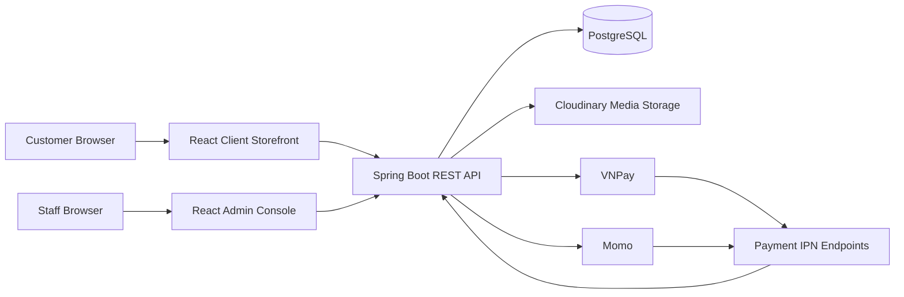

# SYSTEM_ARCHITECTURE

## Purpose

This document describes the high-level architecture of the `ElectronicsManagament` project.

The system is an electronics and gaming e-commerce platform with two user-facing surfaces:

- Client storefront for customers.
- Admin console for staff.

The backend Spring Boot API is the intended source of truth for data, authentication, business rules, payments, warehouse operations, and order workflows.

## System Overview



## Main Applications

| Area | Location | Responsibility |
| --- | --- | --- |
| Client storefront | `frontend/src/pages/Home.jsx`, `frontend/src/components/` | Customer-facing shopping UI. Currently mock-based. |
| Admin console | `frontend/src/pages/admin/`, `frontend/src/components/admin/`, `frontend/src/layouts/AdminLayout.jsx` | Staff-facing dashboard and CRUD UI. Currently mock-based. |
| Backend API | `backend/electronics/src/main/java/org/example/electronics` | REST API, security, business logic, persistence, integrations. |
| Database | PostgreSQL `electronics_management` | Main relational data store. |
| Documentation | `docs/` | Architecture, API contracts, UI rules, workflow notes. |

## Runtime Boundaries

Frontend responsibilities:

- Render client and admin interfaces.
- Manage local UI state.
- Call backend APIs through `frontend/src/api/client.js`.
- Store the admin JWT in `localStorage` under `admin_access_token`.
- Show loading, empty, and error states when real API integration begins.

Backend responsibilities:

- Validate requests.
- Authenticate staff with JWT.
- Enforce business rules.
- Persist data through JPA repositories.
- Map entities to request/response DTOs.
- Handle payment, warehouse, order, media, and cleanup workflows.

Database responsibilities:

- Store product catalog, users, staff, roles, orders, payments, warehouse data, coupons, and invalidated JWT token ids.
- Preserve historical data through soft-delete statuses where implemented.

External integration responsibilities:

- Cloudinary stores uploaded product and variant media.
- VNPay and Momo provide payment and refund workflows.
- Payment IPN endpoints receive asynchronous payment updates.

## Current State

Frontend:

- `/` is a mock dark-theme client homepage.
- `/admin` is a mock admin dashboard.
- Admin CRUD pages exist for categories, brands, products, variants, media, users, staff, roles, orders, warehouse, coupons, and reports.
- Mock data is still used for the UI.
- Axios client is ready for JWT-backed API integration.

Backend:

- Admin APIs exist for catalog, staff, roles, users, orders, payments, warehouse, coupons, media, and return requests.
- Admin authentication uses JWT and stateless Spring Security.
- Payment webhook endpoints exist for VNPay and Momo.
- Public client APIs for storefront product browsing, customer auth, cart, and checkout are not complete yet.

## Request Flow

### Admin Login

```text
Admin UI -> POST /api/admin/auth/login -> AuthenticationManager
  -> StaffDetailsService -> JWT generation -> AdminLoginResponseDTO
  -> frontend stores accessToken as admin_access_token
```

### Authenticated Admin API Request

```text
Admin UI -> Axios client -> Authorization: Bearer <token>
  -> JwtAuthenticationFilter -> SecurityContext
  -> Controller -> Service -> Repository -> PostgreSQL
  -> Mapper -> Response DTO -> Admin UI
```

### Media Upload

```text
Admin UI -> POST /api/admin/media/upload multipart file
  -> SystemCloudinaryService -> Cloudinary
  -> URL/publicId response -> Admin UI
```

### Payment IPN

```text
Payment Provider -> /api/system/payment/*-ipn
  -> SystemPaymentService -> payment/order state update
  -> PostgreSQL
```

## Key Architecture Rules

- Keep client storefront and admin console concerns separate.
- Keep API access centralized in frontend API/service modules.
- Use mock data only as a temporary adapter while backend endpoints are not ready.
- Do not put backend business rules inside React components.
- Do not copy secrets from backend config into docs or frontend code.
- Prefer existing backend layers: controller, service, repository, DTO, mapper, entity.
- Use status-based soft delete where the backend already follows that pattern.

## Related Documents

- `docs/api/ENDPOINTS.md`
- `docs/api/AUTH.md`
- `docs/api/ERROR_FORMAT.md`
- `docs/architecture/FRONTEND_STRUCTURE.md`
- `docs/architecture/BACKEND_STRUCTURE.md`
- `docs/ai-context/PROJECT_CONTEXT.md`
- `docs/ai-context/FRONTEND_GUIDE.md`
- `docs/ai-context/CODING_RULES.md`

## Known Gaps

- Public storefront APIs are not complete.
- Admin frontend is not yet connected to real backend APIs.
- Admin login UI still needs to be added.
- Secrets currently exist in backend configuration and should be moved to environment variables before serious deployment.
- API permission requirements are not yet documented as a full authorization matrix.
