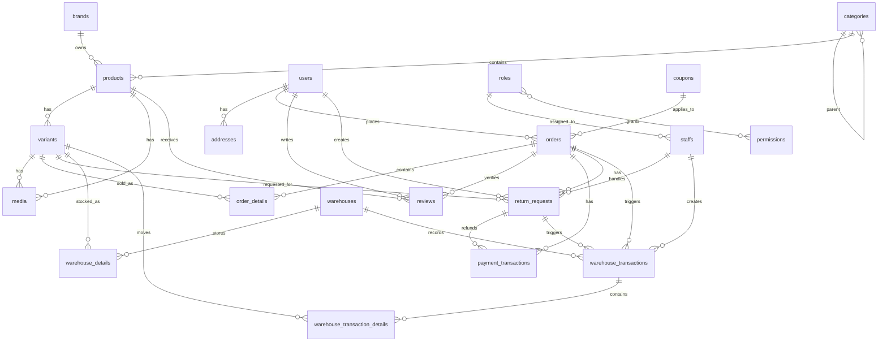

# RELATIONSHIPS

## Purpose

This document describes the main relationships in the current database model.

The relationship source of truth is the JPA entity model in `backend/electronics/src/main/java/org/example/electronics/entity`.

## High-Level ER View



## Catalog Relationships

| Relationship | Type | Notes |
| --- | --- | --- |
| `categories.parent_id -> categories.id` | Many-to-one self reference | Enables root categories and subcategories. |
| `products.category_id -> categories.id` | Many products to one category | Required. |
| `products.brand_id -> brands.id` | Many products to one brand | Required. |
| `variants.product_id -> products.id` | Many variants to one product | Required. |
| `media.product_id -> products.id` | Many media to one product | Optional. |
| `media.variant_id -> variants.id` | Many media to one variant | Optional. |

Media ownership rule:

- A media record should belong to either one product or one variant.
- Service validation rejects records that have both `productId` and `variantId`, or neither.

## People And Access Relationships

| Relationship | Type | Notes |
| --- | --- | --- |
| `addresses.user_id -> users.id` | Many addresses to one user | Required. |
| `staffs.role_id -> roles.id` | Many staff accounts to one role | Required. |
| `role_permissions.role_id -> roles.id` | Join table | Many-to-many. |
| `role_permissions.permission_id -> permissions.id` | Join table | Many-to-many. |

Role and permission note:

- Permissions are modeled and loaded eagerly through roles.
- Endpoint-level fine-grained authorization is not fully documented yet.

## Sales Relationships

| Relationship | Type | Notes |
| --- | --- | --- |
| `orders.user_id -> users.id` | Many orders to one user | Required. |
| `orders.coupon_id -> coupons.id` | Many orders to one coupon | Optional. |
| `order_details.order_id -> orders.id` | Composite key part | Required. |
| `order_details.variant_id -> variants.id` | Composite key part | Required. |
| `reviews.product_id -> products.id` | Many reviews to one product | Required. |
| `reviews.user_id -> users.id` | Many reviews to one user | Required. |
| `reviews.order_id -> orders.id` | Many reviews to one order | Required. |
| `return_requests.user_id -> users.id` | Many return requests to one user | Required. |
| `return_requests.order_id -> orders.id` | Many return requests to one order | Required. |
| `return_requests.variant_id -> variants.id` | Many return requests to one variant | Required. |
| `return_requests.handled_by_staff_id -> staffs.id` | Many return requests to one staff member | Optional. |

Order detail key:

```text
order_details(order_id, variant_id)
```

This means one order can contain a given variant once, with quantity stored on the detail row.

## Coupon Relationships

| Relationship | Type | Notes |
| --- | --- | --- |
| `coupons.category_id -> categories.id` | Many coupons to one category | Optional. |
| `coupons.brand_id -> brands.id` | Many coupons to one brand | Optional. |
| `orders.coupon_id -> coupons.id` | Many orders to one coupon | Optional. |

Coupon scope is flexible:

- No category or brand means broad/global coupon.
- Category only means category-scoped coupon.
- Brand only means brand-scoped coupon.
- Both can represent a narrower scoped coupon if supported by service rules.

## Payment Relationships

| Relationship | Type | Notes |
| --- | --- | --- |
| `payment_transactions.order_id -> orders.id` | Many transactions to one order | Optional in schema, required for normal payments. |
| `payment_transactions.return_request_id -> return_requests.id` | Many transactions to one return request | Optional, used for refunds. |

Payment transaction types:

- `PAYMENT` for order payment records.
- `REFUND` for return/refund records.

## Warehouse Relationships

| Relationship | Type | Notes |
| --- | --- | --- |
| `warehouse_details.warehouse_id -> warehouses.id` | Composite key part | Required. |
| `warehouse_details.variant_id -> variants.id` | Composite key part | Required. |
| `warehouse_transactions.warehouse_id -> warehouses.id` | Many transactions to one warehouse | Required. |
| `warehouse_transactions.staff_id -> staffs.id` | Many transactions to one staff account | Required in entity, but some auto flows may pass null and should be reviewed. |
| `warehouse_transactions.order_id -> orders.id` | Many transactions to one order | Optional. |
| `warehouse_transactions.return_request_id -> return_requests.id` | Many transactions to one return request | Optional. |
| `warehouse_transaction_details.warehouse_transaction_id -> warehouse_transactions.id` | Composite key part | Required. |
| `warehouse_transaction_details.variant_id -> variants.id` | Composite key part | Required. |

Warehouse detail key:

```text
warehouse_details(warehouse_id, variant_id)
```

Warehouse transaction detail key:

```text
warehouse_transaction_details(warehouse_transaction_id, variant_id)
```

## Ownership And Cascade Notes

| Owner | Owned collection | Cascade behavior |
| --- | --- | --- |
| `CategoryEntity` | `subCategoryList` | Cascade all. |
| `OrderEntity` | `orderDetails` | Cascade all, orphan removal. |
| `WarehouseEntity` | `warehouseDetails` | Cascade all, orphan removal. |
| `WarehouseTransactionEntity` | `warehouseTransactionDetails` | Cascade all, orphan removal. |

Product, variant, and media relationships are not broadly cascading. Service code controls media creation/deletion.

## Soft Delete Relationships

Several tables use status values instead of physical delete:

- `categories`
- `brands`
- `products`
- `variants`
- `users`
- `staffs`
- `roles`
- `coupons`
- `warehouses`
- `warehouse_transactions`

Rules:

- Do not assume deleted rows are physically removed.
- UI filters should usually hide `DELETED` records unless the admin intentionally asks for them.
- Service rules may block soft delete when child records still exist.

## Relationship Risks To Watch

- `media` can technically have both foreign keys null unless service validation is used.
- `warehouse_transactions.staff_id` is non-null in the entity, but some auto-created flows pass nullable `staffId`; review this before production.
- `ddl-auto: update` does not replace explicit migration review.
- JSON fields are flexible but need DTO validation to avoid malformed UI assumptions.
