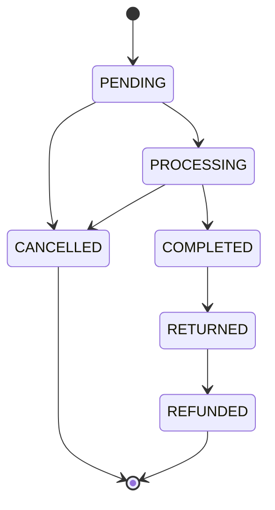

# ORDER_FLOW

## Purpose

This document describes the intended order lifecycle and the backend state transitions currently visible in admin order and warehouse services.

Customer checkout APIs are not complete yet, so this document focuses on the backend/admin flow that exists now.

## Main Entities

- `OrderEntity`
- `OrderDetailEntity`
- `PaymentTransactionEntity`
- `WarehouseTransactionEntity`
- `WarehouseTransactionDetailEntity`
- `ReturnRequestEntity`

## Order Statuses

```text
PENDING
PROCESSING
COMPLETED
CANCELLED
RETURNED
REFUNDED
```

Allowed order transitions:

| Current | Allowed next |
| --- | --- |
| `PENDING` | `PROCESSING`, `CANCELLED` |
| `PROCESSING` | `COMPLETED`, `CANCELLED` |
| `COMPLETED` | `RETURNED` |
| `RETURNED` | `REFUNDED` |
| `CANCELLED` | None |
| `REFUNDED` | None |

## Payment Statuses

```text
PENDING
PAID
FAILED
CANCELLED
REFUNDED
```

Allowed payment transitions:

| Current | Allowed next |
| --- | --- |
| `PENDING` | `PAID`, `FAILED`, `CANCELLED` |
| `PAID` | `REFUNDED` |
| `FAILED` | None |
| `CANCELLED` | None |
| `REFUNDED` | None |

## Shipping Statuses

```text
PENDING
SHIPPING
DELIVERED
RETURNED
CANCELLED
```

Allowed shipping transitions:

| Current | Allowed next |
| --- | --- |
| `PENDING` | `SHIPPING`, `CANCELLED` |
| `SHIPPING` | `DELIVERED`, `RETURNED`, `CANCELLED` |
| `DELIVERED` | `RETURNED` |
| `RETURNED` | None |
| `CANCELLED` | None |

## Order Flow Diagram



## Warehouse Side Effects

Order status changes can create warehouse transactions.

| Transition | Warehouse action |
| --- | --- |
| `PENDING -> PROCESSING` | Create export transaction for order. |
| `PENDING -> CANCELLED` | Create unreserved transaction for order. |
| `PROCESSING -> CANCELLED` | Create return transaction for order. |
| `COMPLETED -> RETURNED` | Create return transaction for order. |

Additional warehouse behavior:

- Stock can be reserved for orders.
- Internal transfers can consolidate stock into a target warehouse.
- Export transactions reduce stock.
- Return and unreserved transactions increase stock.

## Admin Update Rules

Endpoint:

```http
PATCH /api/admin/orders/{orderId}
```

Request body:

```json
{
  "trackingCode": "TRACK123",
  "status": "PROCESSING",
  "paymentStatus": "PAID",
  "shippingProvider": "GHN",
  "shippingStatus": "SHIPPING"
}
```

Rules:

- Invalid order, payment, or shipping transitions are rejected.
- Shipping provider cannot be changed once shipping has started.
- Tracking code is required when shipping status is `SHIPPING` or `DELIVERED`.
- `paidAt` is set when payment status becomes `PAID`.

## Payment Provider Flow

Digital payment success:

```text
Payment provider IPN
  -> validate signature
  -> verify order and amount
  -> mark transaction SUCCESS
  -> confirm successful payment
```

Digital payment failure:

```text
Payment provider IPN
  -> validate signature
  -> mark transaction FAILED or CANCELLED
  -> close unpaid pending order
  -> release reserved stock
```

## Expired Pending Orders

The backend has an order cleanup scheduler path.

Current behavior for a single expired pending order:

- Only handles orders still in `PENDING`.
- Sets order status to `CANCELLED`.
- Sets payment status to `FAILED`.
- Adds a system note.
- Creates an unreserved warehouse transaction.

## Return And Refund Flow

High-level intended flow:

```text
Customer return request
  -> Admin review
  -> Return request status changes
  -> Warehouse return transaction when approved/completed
  -> Refund strategy by original payment provider
  -> Payment transaction type REFUND
  -> Order/payment state moves toward RETURNED/REFUNDED
```

## UI Implications

Admin order UI should:

- Show order status, payment status, and shipping status separately.
- Disable impossible next states.
- Require tracking code for active shipping states.
- Warn when cancellation or return will trigger stock movement.
- Show related warehouse transactions when available.

Client order UI should:

- Show a simplified status timeline.
- Avoid exposing internal warehouse statuses.
- Show payment failure and retry paths when supported.

## Known Gaps

- Public checkout APIs are not complete.
- Full return/refund state matrix needs stronger documentation before production.
- Payment state and order state should be tested together.
