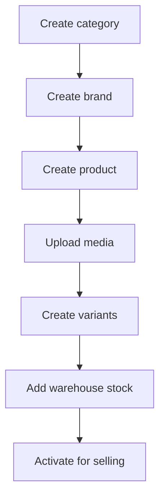

# PRODUCT_FLOW

## Purpose

This document describes the catalog workflow for categories, brands, products, variants, media, and warehouse stock.

## Main Entities

- `CategoryEntity`
- `BrandEntity`
- `ProductEntity`
- `VariantEntity`
- `MediaEntity`
- `WarehouseEntity`
- `WarehouseDetailEntity`

## Product Model

The catalog has two product levels:

```text
Product = base item
Variant = sellable SKU-like option
```

Example:

```text
Product: ASUS ROG Zephyrus G14 2024
Variant: ASUS ROG Zephyrus G14 2024 / 32GB RAM / 1TB SSD / Eclipse Gray
```

## Catalog Setup Flow

Recommended order:

1. Create categories.
2. Create brands.
3. Create base products.
4. Upload product or variant images.
5. Create variants.
6. Add warehouse stock.
7. Activate items for selling.

## Category Flow

Categories support parent-child hierarchy.

Rules:

- Root categories have no `parentId`.
- Subcategories reference a parent category.
- Category `slug` must be unique.
- Soft delete sets status to `DELETED`.
- Deleting a category with subcategories may be blocked by service rules.

Status:

```text
ACTIVE
HIDDEN
DELETED
```

## Brand Flow

Rules:

- Brand `name` must be unique.
- Brand image is optional.
- Soft delete sets status to `DELETED`.
- Brand status affects product filtering and admin visibility.

## Product Flow

Product creation requires:

- `name`
- `slug`
- `categoryId`
- `brandId`
- `warrantyMonths`
- `status`

Optional fields:

- `description`
- `specsJson`
- `media`

Rules:

- Product `name` and `slug` must be unique.
- Product must belong to one category and one brand.
- Product delete is blocked when variants still exist.
- Product specs should describe shared attributes.

## Variant Flow

Variant creation requires:

- `productId`
- `name`
- `slug`
- `color`
- `price`
- `totalStock`
- `status`

Optional fields:

- `specsJson`
- `media`

Rules:

- Variant `name` and `slug` must be unique.
- Variant belongs to one product.
- Variant is the unit used by orders and warehouse stock.
- Variant specs should describe option-specific attributes.

## Media Flow

Upload first:

```text
POST /api/admin/media/upload
```

Then attach returned values:

```json
{
  "imageUrl": "https://...",
  "publicId": "electronics_store/example",
  "isPrimary": true,
  "displayOrder": 0
}
```

Rules:

- Media belongs to either product or variant.
- Only one primary image should exist per product or variant group.
- `displayOrder` controls image sorting.
- Cloud media cleanup must stay aligned with DB media deletion.

## Warehouse Stock Flow

Stock is stored at two levels:

- `variants.total_stock`: total stock across all warehouses.
- `warehouse_details.quantity`: stock for a variant in one warehouse.

Warehouse transaction types:

```text
IMPORT
EXPORT
RETURN
RESERVED
UNRESERVED
INTERNAL_TRANSFER
```

Rules:

- Manual stock changes should happen through warehouse transactions.
- Completed inward transactions increase stock.
- Completed outward transactions decrease stock.
- Warehouse current stock must not exceed capacity.

## Product Visibility

Client storefront should only show sellable records:

- Category status is `ACTIVE`.
- Brand status is `ACTIVE`.
- Product status is `ACTIVE`.
- Variant status is `ACTIVE`.
- Variant stock is greater than zero when stock filtering is required.

Admin should be able to view more statuses for management.

## Product Flow Diagram



## UI Implications

Admin product UI should support:

- Category and brand selectors.
- Product-level specs editor.
- Variant management from product row/detail.
- Media upload and ordering.
- Status changes.
- Warehouse stock visibility per variant.

Client product UI should support:

- Category filtering.
- Brand filtering.
- Variant selection.
- Image gallery.
- Price and stock display.
- Add to cart.

## Known Gaps

- Public product listing/detail APIs are not complete.
- Product form and variant form are not connected to real APIs yet.
- Specs JSON needs a consistent UI schema per category later.
